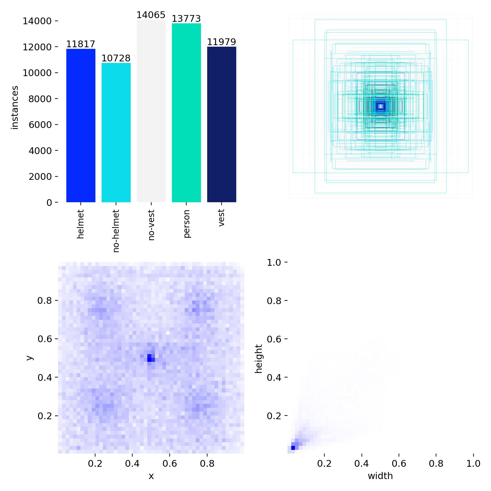
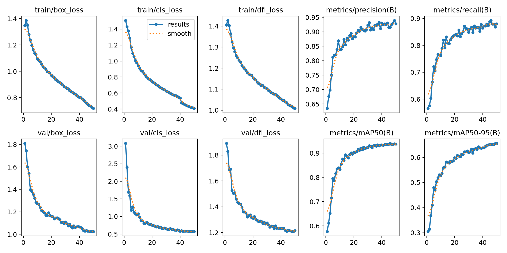
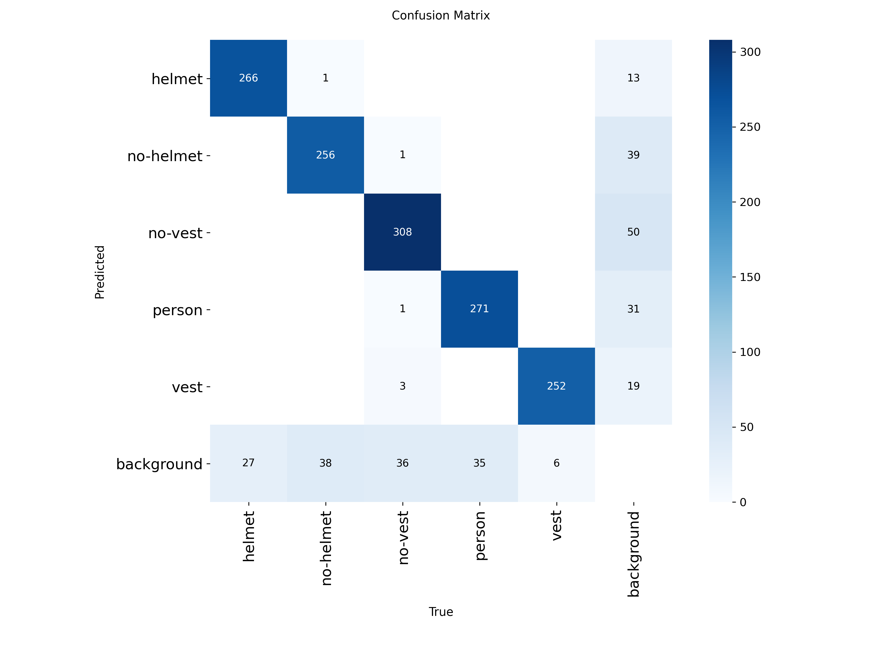
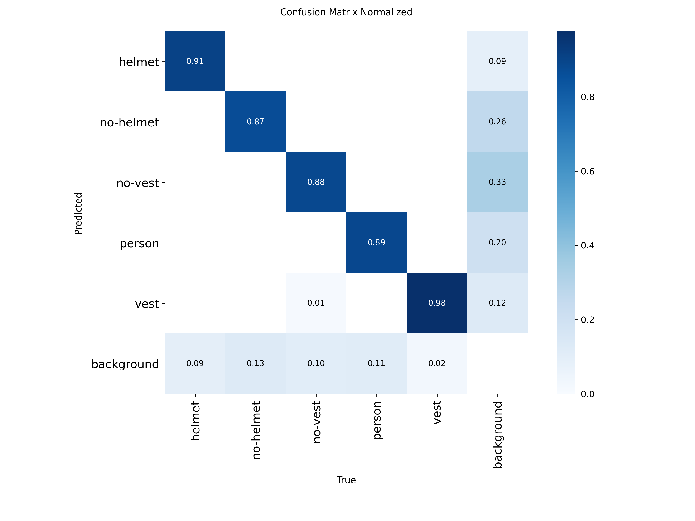
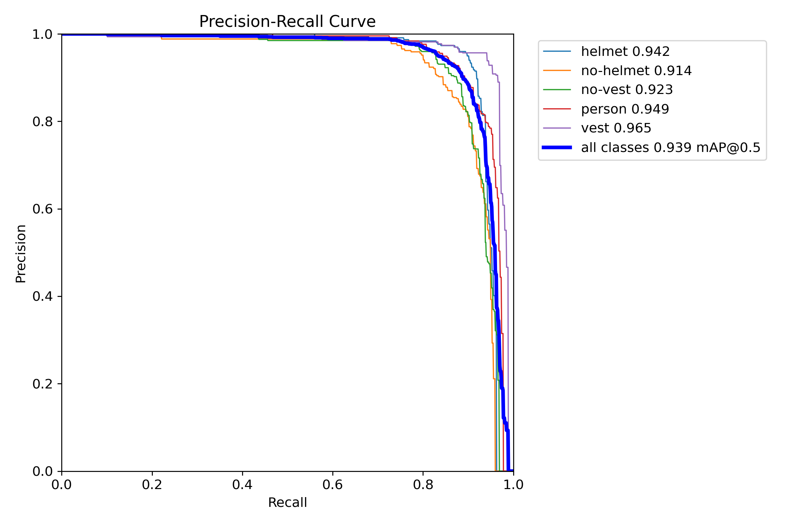
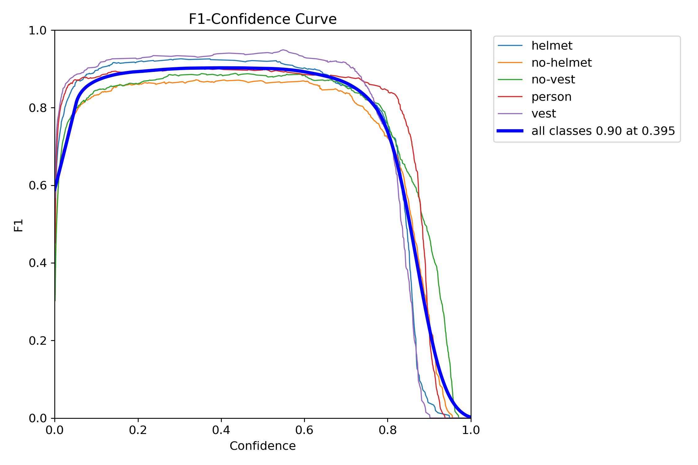
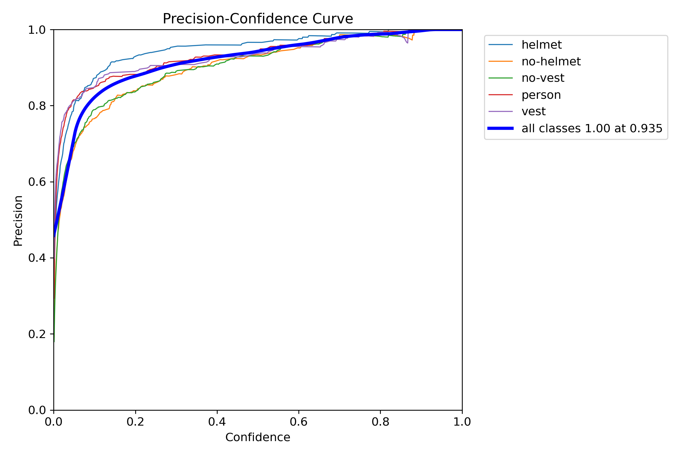
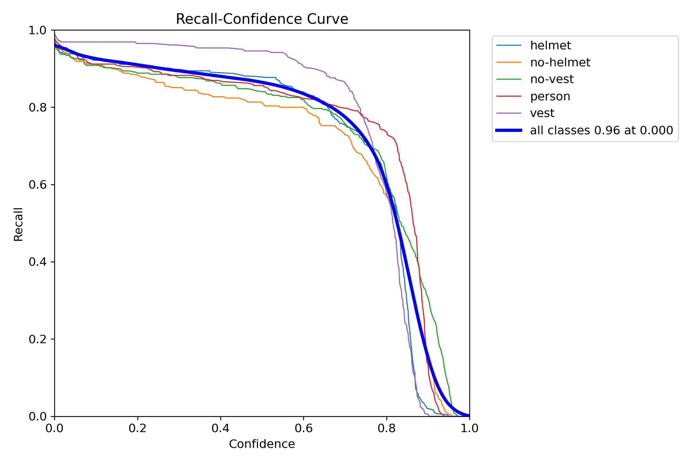

<p align="center">
  <h1 align="center">🦺 PPE Compliance Detection</h1>
  <p align="center">
    <strong>Real-time construction-site safety monitoring powered by fine-tuned YOLO11m</strong>
  </p>
  <p align="center">
    <a href="#-results"></a>
    <a href="#-results"></a>
    <a href="#-results"></a>
    <a href="#-results"></a>
  </p>
</p>

---

## 📋 Table of Contents

- [Overview](#-overview)
- [Classes](#-classes)
- [Compliance Logic](#-compliance-logic)
- [Project Structure](#-project-structure)
- [Dataset](#-dataset)
- [Model Training](#-model-training)
- [Results](#-results)
  - [Training Curves](#training-curves)
  - [Confusion Matrix](#confusion-matrix)
  - [Precision-Recall Curve](#precision-recall-curve)
  - [F1-Confidence Curve](#f1-confidence-curve)
  - [Precision-Confidence Curve](#precision-confidence-curve)
  - [Recall-Confidence Curve](#recall-confidence-curve)
- [Streamlit Application](#-streamlit-application)
- [Deployment](#-deployment)
- [Tech Stack](#-tech-stack)

---

## 🔍 Overview

This project implements an end-to-end **Personal Protective Equipment (PPE) compliance detection system** for construction sites. It uses a fine-tuned **YOLO11m** (medium) object detection model to identify whether workers are wearing the required safety gear — specifically **helmets** and **safety vests** — and determines per-person compliance status in real time.

The system goes beyond simple object detection by implementing:

- **Person-level PPE association** — links detected PPE items to specific persons using anatomical region matching (head region for helmets, torso region for vests)
- **Compliance determination** — classifies each person as `COMPLIANT`, `VIOLATION`, or `UNKNOWN`
- **Temporal violation confirmation** (video mode) — uses IoU-based person tracking and a frame-based confirmation window to prevent false alerts from single-frame detection noise
- **Real-time inference** — supports image, video, and live webcam processing through a Streamlit web application

---

## 🏷️ Classes

The model detects **5 classes** representing PPE states on construction workers:

| Class ID | Class Name | Description | Role |
|:--------:|:----------:|:------------|:-----|
| 0 | `helmet` | Worker wearing a safety helmet | ✅ Positive PPE indicator |
| 1 | `no-helmet` | Worker's head without a helmet | ❌ Violation indicator |
| 2 | `no-vest` | Worker's torso without a safety vest | ❌ Violation indicator |
| 3 | `person` | Detected person / worker | 👤 Association anchor |
| 4 | `vest` | Worker wearing a safety vest | ✅ Positive PPE indicator |

---

## ✅ Compliance Logic

Each detected **person** is evaluated for PPE compliance by associating nearby PPE detections using anatomical region heuristics:

```
Person Bounding Box
┌──────────────────────┐
│   HEAD REGION (0-40%)│  ← Helmet / No-Helmet detection zone
│                      │
│  TORSO REGION (20-80%)│  ← Vest / No-Vest detection zone
│                      │
│                      │
└──────────────────────┘
```

| Helmet Status | Vest Status | Compliance |
|:-------------:|:-----------:|:----------:|
| ✅ Helmet | ✅ Vest | **COMPLIANT** |
| ❌ No-Helmet | ✅ Vest | **VIOLATION** |
| ✅ Helmet | ❌ No-Vest | **VIOLATION** |
| ❌ No-Helmet | ❌ No-Vest | **VIOLATION** |
| ❓ Unknown | ❓ Unknown | **UNKNOWN** |

---

## 📁 Project Structure

```
PPE-Compliance-Detection/
│
├── app.py                      # Streamlit web application (main entry point)
├── ppe_engine.py               # Core detection engine (YOLO wrapper, tracking, compliance)
├── requirements.txt            # Python dependencies
├── packages.txt                # System-level dependencies (for Streamlit Cloud)
│
├── .streamlit/
│   └── config.toml             # Streamlit dark theme configuration
│
├── models/
│   └── best.pt                 # Fine-tuned YOLO11m weights (~40 MB)
│
├── results/
│   ├── results.png             # Training metrics overview (loss, precision, recall, mAP)
│   ├── results.csv             # Raw training metrics per epoch
│   ├── confusion_matrix.png    # Confusion matrix (absolute counts)
│   ├── confusion_matrix_normalized.png  # Confusion matrix (normalized)
│   ├── labels.jpg              # Dataset class distribution & bbox analysis
│   ├── error_analysis.csv      # Per-image error analysis (FP, FN, class confusions)
│   └── curves/
│       ├── BoxF1_curve.png     # F1 score vs confidence threshold
│       ├── BoxPR_curve.png     # Precision-Recall curve
│       ├── BoxP_curve.png      # Precision vs confidence threshold
│       └── BoxR_curve.png      # Recall vs confidence threshold
│
├── notebooks/
│   ├── industrial-safety.ipynb # Original Kaggle training notebook
│   └── industrial-safety.py   # Exported Python script from notebook
│
└── README.md                   # This file
```

---

## 📊 Dataset

- **Source**: [Roboflow `construction-rineu`](https://universe.roboflow.com/envisage/construction-rineu) (Version 3)
- **Format**: YOLO (bounding box annotations)
- **Total annotations**: ~62,362 instances across 5 classes

### Class Distribution

<p align="center">
  
</p>

The dataset is well-balanced across all five classes, with instance counts ranging from ~10,728 (no-helmet) to ~14,065 (no-vest). The bounding box center distribution and size distribution show a natural spread typical of construction site imagery.

### Data Curation

Before training, the following data-quality issues were identified and fixed:
- Cross-split duplicate images (same image in train + valid) — removed from train
- Duplicate images with conflicting annotations — kept the correctly annotated copy
- Images with empty or malformed label files — removed

---

## 🏋️ Model Training

| Parameter | Value |
|:----------|:------|
| **Architecture** | YOLO11m (Medium) |
| **Pretrained** | Yes (COCO weights) |
| **Input Size** | 640 × 640 |
| **Epochs** | 50 |
| **Batch Size** | 16 |
| **Optimizer** | AdamW (Ultralytics default) |
| **Seed** | 42 (deterministic training) |
| **Checkpoint Strategy** | Best + every 5 epochs |

---

## 📈 Results

### Final Metrics (Epoch 50)

| Metric | Value |
|:-------|:-----:|
| **Precision** | 92.8% |
| **Recall** | 88.0% |
| **mAP@50** | 93.8% |
| **mAP@50-95** | 65.6% |
| **F1 Score** | 0.90 @ conf=0.395 |

### Per-Class Performance (from PR Curve)

| Class | AP@50 |
|:------|:-----:|
| Helmet | 94.2% |
| No-Helmet | 91.4% |
| No-Vest | 92.3% |
| Person | 94.9% |
| Vest | 96.5% |

---

### Training Curves

Complete training and validation metrics across 50 epochs — showing convergent loss curves and steadily improving precision, recall, and mAP.

<p align="center">
  
</p>

**Key observations:**
- All three training losses (box, classification, distribution focal) decrease smoothly without signs of overfitting
- Validation losses plateau around epoch 35–40, indicating good generalization
- mAP@50 reaches **~94%** and mAP@50-95 reaches **~66%** by the final epoch
- Precision stabilizes above **92%** and recall above **87%** from epoch 25 onward

---

### Confusion Matrix

<p align="center">
  
  
</p>

**Key observations:**
- Strong diagonal dominance — the model correctly classifies the vast majority of detections
- **Vest** has the highest accuracy at **98%** normalized recall
- **Helmet** shows **91%** normalized recall
- Minimal cross-class confusion — virtually no helmet↔vest or person↔PPE misclassifications
- The primary error mode is **background false negatives** (missed detections), not class confusion
- Only **1** helmet↔no-helmet confusion case — critical for compliance accuracy

---

### Precision-Recall Curve

<p align="center">
  
</p>

The PR curve shows **all classes achieving mAP@50 above 91%**, with the overall mean at **93.9%**. The curves maintain high precision (>0.95) until recall reaches ~0.80, indicating the model is reliable at moderate confidence thresholds. **Vest** (96.5%) and **Person** (94.9%) achieve the highest AP scores.

---

### F1-Confidence Curve

<p align="center">
  
</p>

The F1 score peaks at **0.90 across all classes at a confidence threshold of 0.395**. This optimal threshold balances precision and recall, making it the recommended operating point for deployment. All individual classes maintain F1 > 0.85 in the 0.2–0.6 confidence range.

---

### Precision-Confidence Curve

<p align="center">
  
</p>

Precision increases monotonically with confidence, reaching **1.00 at confidence 0.935** across all classes. Even at low confidence thresholds (0.1), precision remains above 0.70, indicating the model produces relatively few false positives.

---

### Recall-Confidence Curve

<p align="center">
  
</p>

At the lowest confidence threshold, recall reaches **0.96 across all classes**. **Vest** maintains the highest recall across all confidence levels, while **no-helmet** shows the steepest decline at higher thresholds — expected given the visual subtlety of detecting a missing helmet.

---

## 🖥️ Streamlit Application

The project includes a full-featured Streamlit web app (`app.py`) with a premium dark-themed UI supporting three inference modes:

### 📷 Image Mode
- Upload construction site images (JPG, PNG, WEBP)
- Side-by-side view: original image vs annotated detections
- Per-person compliance table with status badges
- Summary metrics (total persons, compliant, violations)

### 🎬 Video Mode
- Upload construction site videos (MP4, AVI, MOV)
- Frame-by-frame processing with live progress bar
- IoU-based person tracking for consistent IDs across frames
- Temporal violation confirmation (prevents single-frame false alerts)
- Violation event log with timestamps
- Processed video playback

### 📹 Real-Time Camera Mode
- Live webcam feed via WebRTC (`streamlit-webrtc`)
- Works from laptop camera or phone browser
- Real-time compliance detection and status overlays
- Active violation alerts

### Configurable Parameters
- **Confidence Threshold**: 0.10–0.90 (default: 0.25)
- **IoU Threshold**: 0.10–0.90 (default: 0.50)

---

## 🚀 Deployment

### Streamlit Cloud

1. **Push to GitHub** — include all project files (use Git LFS for `models/best.pt` if needed)
2. **Connect** at [share.streamlit.io](https://share.streamlit.io) → link your GitHub repo
3. **Set main file** to `app.py`
4. Streamlit Cloud automatically installs dependencies from `requirements.txt` and `packages.txt`

> **Note:** Real-time camera mode requires HTTPS (provided by Streamlit Cloud by default).

### Local Development

```bash
# Install dependencies
pip install -r requirements.txt

# Run the app
streamlit run app.py
```

---

## 🛠️ Tech Stack

| Component | Technology |
|:----------|:-----------|
| **Object Detection** | YOLO11m (Ultralytics) |
| **Training Platform** | Kaggle (GPU) |
| **Dataset** | Roboflow `construction-rineu` |
| **Web Framework** | Streamlit |
| **Real-Time Streaming** | streamlit-webrtc (WebRTC) |
| **Computer Vision** | OpenCV, NumPy, Pillow |
| **Deep Learning** | PyTorch (via Ultralytics) |

---

<p align="center">
  <sub>Built for construction-site safety monitoring — detecting PPE compliance violations in real time.</sub>
</p>
